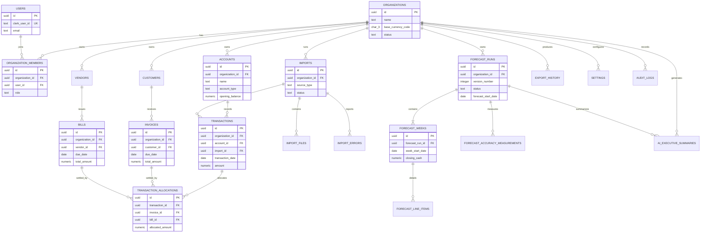

# FinanceOS MVP — Phase 2: Database Design & Data Model

**Status:** Proposed for engineering review  
**Database:** PostgreSQL 16+  
**Scope:** Single legal entity and single currency per organization in the MVP; multi-tenant SaaS from day one.

## 1. Design principles

- Each business-owned record carries `organization_id`; the organization is the tenant boundary.
- UUID primary keys prevent identifier enumeration and ease future data movement. Timestamps are `timestamptz`; financial values are `numeric(19,4)`, never floating point.
- Source records are immutable in meaning. Corrections use a new version, reversal, or an explicit audit event—not silent mutation.
- Operational configuration is normalized; only genuinely variable integration payloads and audit diffs use `jsonb`.
- MVP operates one PostgreSQL database with shared tables and application-enforced tenant filtering. PostgreSQL RLS is a planned defense-in-depth layer, not a substitute for authorization.

### Standard columns and conventions

All tenant business tables use `id uuid`, `organization_id uuid`, `created_at timestamptz not null default now()`, and `updated_at timestamptz not null default now()` unless noted. `created_by_user_id` / `updated_by_user_id` are added where a human edit matters. IDs are generated by PostgreSQL. Monetary columns pair with the organization currency in MVP and use `numeric(19,4)`. Dates representing accounting or cash timing use `date`; event timing uses `timestamptz`.

## 2. Domain model

| Entity | Ownership and lifecycle | Why it exists / future readiness |
|---|---|---|
| Organization | Tenant root; created during provisioning; never hard-deleted in ordinary operation. | Holds customer-level identity, base currency, and finance policies. A future `legal_entities` table can sit beneath it. |
| User | Globally owned identity, provisioned by Clerk; may belong to many organizations. | Keeps identity separate from tenant membership. |
| OrganizationMember | Organization-owned membership; deactivated rather than erased. | Supports roles and later custom permissions. |
| Account | Organization-owned financial account; archived when closed. | Represents a bank/cash account today, extensible to card, loan, and ledger accounts. |
| Customer / Vendor | Organization-owned counterparty masters; merged or archived, not casually deleted. | Avoids copying names across invoices, bills, and transactions. |
| Transaction | Account-owned imported or manual cash movement. Financially immutable after import acceptance. | The cash actuals ledger and traceability anchor. |
| Invoice / Bill | Organization-owned receivable/payable document and payment expectation. | Separates commercial obligations from bank cash events. |
| TransactionAllocation | Links one transaction to one or many invoices/bills. | Necessary for partial payments and reconciliation; recommended addition. |
| Import / ImportFile / ImportError | Organization-owned ingestion job, original file, and row-level result. | Preserves provenance, retryability, and secure file handling. |
| ForecastRun / ForecastWeek / ForecastLineItem | Immutable organization-owned forecast snapshot hierarchy. | Forecasts must be comparable over time and never overwritten. |
| ForecastAccuracyMeasurement | Organization-owned post-period comparison of forecast to actual. | Provides accuracy history and future ML training labels. |
| ExportHistory | Organization-owned generated-report record. | Auditability and signed-download lifecycle. |
| AIExecutiveSummary | Organization-owned generated narrative tied to one forecast run. | Ensures an AI response is traceable to exact input snapshot/version. |
| Setting | Organization-owned scoped settings. | Stores small configuration values without proliferating columns; sensitive settings remain in a secret manager. |
| AuditLog | Append-only organization-owned event record. | Regulatory and operational evidence. |

## 3. Entity relationship diagram

## 4. Table specifications

### Identity and tenancy

| Table | Columns, constraints, and defaults | Notes |
|---|---|---|
| `organizations` | `id`; `name text not null`; `slug citext not null unique`; `base_currency_code char(3) not null`; `status text not null default 'active' check (status in ('active','suspended','closed'))`; `timezone text not null default 'UTC'`; standard timestamps; `deleted_at timestamptz null`. | `slug` is a stable human-facing identifier. Check ISO currency in app/reference data; MVP locks it after first financial record. |
| `users` | `id`; `clerk_user_id text not null unique`; `email citext not null unique`; `display_name text null`; `last_login_at timestamptz null`; timestamps. | Global identity table. Clerk is source of authentication truth; do not store passwords. |
| `organization_members` | `id`; `organization_id not null FK organizations`; `user_id not null FK users`; `role text not null check (role in ('owner','admin','finance_manager','analyst','viewer'))`; `status text not null default 'active' check (status in ('active','inactive'))`; `joined_at timestamptz not null default now()`; `deactivated_at null`; `unique(organization_id,user_id)`. | Membership row is the authorization subject. No soft-delete needed: retain inactive history. |
| `settings` | `id`; `organization_id not null FK`; `setting_key text not null`; `value_json jsonb not null`; `updated_by_user_id FK users null`; timestamps; `unique(organization_id,setting_key)`. | Non-secret preferences only: forecast horizon, categorization rules, reporting calendar. Validate each known key at service boundary. |

### Cash and commercial documents

| Table | Columns, constraints, and defaults | Notes |
|---|---|---|
| `accounts` | `id`; `organization_id not null FK`; `external_account_id text null`; `name text not null`; `account_type text not null check (account_type in ('bank','cash','credit_card','loan','other'))`; `institution_name text null`; `currency_code char(3) not null`; `opening_balance numeric(19,4) not null default 0`; `opening_balance_date date null`; `status text not null default 'active' check (status in ('active','archived'))`; timestamps; `deleted_at null`; `unique(organization_id, external_account_id)` where external ID is present. | In MVP `currency_code` must equal organization base currency. Keep account even after closure for historical reporting. |
| `transactions` | `id`; `organization_id not null FK`; `account_id not null FK accounts`; `import_id FK imports null`; `external_transaction_id text null`; `transaction_date date not null`; `posted_at timestamptz null`; `description text not null`; `amount numeric(19,4) not null check (amount <> 0)`; `currency_code char(3) not null`; `direction text generated/derived from amount` (or checked `inflow`/`outflow`); `category text null`; `counterparty_name text null`; `status text not null default 'posted' check (status in ('pending','posted','reversed'))`; `source_hash bytea null`; timestamps; `unique(account_id, external_transaction_id)` where present. | Do not store a mutable “balance.” Reconciliation derives balance from an ordered ledger. `source_hash` supports CSV duplicate detection. |
| `customers` | `id`; `organization_id not null FK`; `external_customer_id text null`; `name text not null`; `email citext null`; `payment_terms_days smallint null check (payment_terms_days >= 0)`; `status text not null default 'active'`; timestamps; `deleted_at null`; `unique(organization_id,name)` for MVP. | Archive/merge instead of deletion if referenced. |
| `vendors` | Same pattern as `customers`, with `external_vendor_id`. | Separate table avoids ambiguous party role and simplifies MVP workflows. A future party model can unify them. |
| `invoices` | `id`; `organization_id not null FK`; `customer_id not null FK customers restrict`; `import_id FK imports null`; `external_invoice_id text null`; `invoice_number text not null`; `issue_date date not null`; `due_date date not null check (due_date >= issue_date)`; `total_amount numeric(19,4) not null check (total_amount > 0)`; `currency_code char(3) not null`; `status text not null check (status in ('draft','open','partially_paid','paid','void','overdue'))`; `expected_payment_date date null`; `metadata jsonb not null default '{}'`; timestamps; `deleted_at null`; `unique(organization_id,invoice_number)`. | Outstanding balance is derived from allocations, optionally materialized in a refreshable projection. |
| `bills` | `id`; `organization_id not null FK`; `vendor_id not null FK vendors restrict`; `import_id FK imports null`; `external_bill_id text null`; `bill_number text not null`; `issue_date`, `due_date`, `total_amount`, `currency_code`, `status`, `expected_payment_date`, metadata, timestamps, and uniqueness mirror invoices. | A bill is an expected outflow; a transaction is actual cash. |
| `transaction_allocations` | `id`; `organization_id not null FK`; `transaction_id not null FK transactions restrict`; `invoice_id FK invoices restrict null`; `bill_id FK bills restrict null`; `allocated_amount numeric(19,4) not null check (allocated_amount > 0)`; `allocated_on date not null`; timestamps; check exactly one of `invoice_id`, `bill_id` is non-null; unique `(transaction_id, invoice_id)` and `(transaction_id, bill_id)` where applicable. | Reconciliation bridge. Service/trigger validates allocation sign and that cumulative allocation does not exceed source amount/document balance. |

### Imports, forecasts, and outputs

| Table | Columns, constraints, and defaults | Notes |
|---|---|---|
| `imports` | `id`; `organization_id not null FK`; `initiated_by_user_id FK users null`; `source_type text not null check (source_type in ('csv_bank','csv_invoice','csv_bill','quickbooks'))`; `status text not null default 'queued' check (status in ('queued','processing','completed','completed_with_errors','failed','cancelled'))`; `idempotency_key text null`; `started_at`, `completed_at timestamptz null`; `records_received integer not null default 0`; `records_imported integer not null default 0`; `records_rejected integer not null default 0`; timestamps; unique `(organization_id,idempotency_key)` where present. | Job-level record. It is append-only after completion. |
| `import_files` | `id`; `organization_id not null FK`; `import_id not null FK imports cascade`; `storage_key text not null unique`; `original_filename text not null`; `content_type text not null`; `size_bytes bigint not null check (size_bytes > 0)`; `sha256 char(64) not null`; `uploaded_at timestamptz not null default now()`; `retention_until timestamptz null`; `unique(import_id,sha256)`. | S3 object metadata only; file bytes never enter PostgreSQL. |
| `import_errors` | `id`; `organization_id not null FK`; `import_id not null FK imports cascade`; `import_file_id FK import_files cascade null`; `row_number integer null check (row_number > 0)`; `field_name text null`; `error_code text not null`; `message text not null`; `raw_row jsonb null`; `created_at`. | Retain for operational support; redact sensitive raw values where needed. |
| `forecast_runs` | `id`; `organization_id not null FK`; `initiated_by_user_id FK users null`; `forecast_start_date date not null`; `horizon_weeks smallint not null default 13 check (horizon_weeks between 1 and 104)`; `version_number integer not null`; `run_type text not null default 'baseline' check (run_type in ('baseline','manual','scenario'))`; `status text not null check (status in ('queued','running','completed','failed'))`; `algorithm_name text not null`; `algorithm_version text not null`; `input_snapshot jsonb not null`; `generated_at timestamptz null`; `completed_at timestamptz null`; timestamps; `unique(organization_id,forecast_start_date,version_number,run_type)`. | Immutable once completed. `input_snapshot` captures assumptions, source cut-off, and configuration for reproducibility. |
| `forecast_weeks` | `id`; `organization_id not null FK`; `forecast_run_id not null FK forecast_runs cascade`; `week_start_date date not null`; `opening_cash numeric(19,4) not null`; `inflows numeric(19,4) not null default 0`; `outflows numeric(19,4) not null default 0`; `net_cash_flow numeric(19,4) not null`; `closing_cash numeric(19,4) not null`; `actual_closing_cash numeric(19,4) null`; timestamps; `unique(forecast_run_id,week_start_date)`. | `net_cash_flow = inflows - outflows` and closing equals opening plus net are validated at write time. |
| `forecast_line_items` | `id`; `organization_id not null FK`; `forecast_week_id not null FK forecast_weeks cascade`; `source_type text not null check (source_type in ('transaction','invoice','bill','recurring_rule','manual_adjustment','model_estimate'))`; `source_id uuid null`; `category text not null`; `description text not null`; `amount numeric(19,4) not null check (amount <> 0)`; `cash_date date not null`; `confidence numeric(5,4) null check (confidence between 0 and 1)`; `assumption_json jsonb null`; timestamps. | The immutable explanation layer for drill-down. Source ID is intentionally polymorphic and is paired with source type. |
| `forecast_accuracy_measurements` | `id`; `organization_id not null FK`; `forecast_run_id not null FK forecast_runs restrict`; `forecast_week_id not null FK forecast_weeks restrict`; `measured_at timestamptz not null`; `actual_inflows numeric(19,4) not null`; `actual_outflows numeric(19,4) not null`; `actual_closing_cash numeric(19,4) not null`; `closing_cash_variance numeric(19,4) not null`; `absolute_percentage_error numeric(10,6) null`; `unique(forecast_week_id)`. | One measurement per forecasted week. `null` percentage error prevents divide-by-zero distortion. |
| `ai_executive_summaries` | `id`; `organization_id not null FK`; `forecast_run_id not null FK forecast_runs restrict`; `requested_by_user_id FK users null`; `provider text not null`; `model text not null`; `prompt_version text not null`; `input_hash char(64) not null`; `summary_json jsonb not null`; `status text not null default 'completed'`; `token_usage integer null`; `created_at`; `unique(forecast_run_id,prompt_version,input_hash)`. | Store structured response and reproducibility metadata, not credentials or raw provider secrets. |
| `export_history` | `id`; `organization_id not null FK`; `requested_by_user_id FK users null`; `export_type text not null`; `format text not null check (format in ('csv','xlsx','pdf'))`; `filter_snapshot jsonb not null default '{}'`; `storage_key text null`; `status text not null`; `expires_at timestamptz null`; `created_at`; `completed_at null`. | Export contents may be regenerated from snapshot; ephemeral files use a retention policy. |
| `audit_logs` | `id uuid`; `organization_id FK organizations null`; `actor_user_id FK users null`; `event_type text not null`; `entity_type text null`; `entity_id uuid null`; `request_id uuid null`; `ip_hash bytea null`; `user_agent text null`; `before_json jsonb null`; `after_json jsonb null`; `metadata jsonb not null default '{}'`; `occurred_at timestamptz not null default now()`. | Append-only. `organization_id` is null only for pre-tenant authentication/system events. |

## 5. Financial data model and traceability

An `account` owns posted `transactions`, which represent actual cash movement. An invoice is an expected customer inflow; a bill is an expected vendor outflow. `transaction_allocations` reconcile actual payments to commercial documents, allowing both a partial payment and a single payment covering several documents. Allocation totals may not exceed either the absolute transaction amount or the remaining document balance.

A forecast run snapshots the source cutoff and assumptions, then creates weeks and explanatory line items. Line items may reference invoices, bills, historical transactions, or a recorded model assumption. This establishes a trace from dashboard number → forecast week → line item → original source record → import and file. Transaction alterations use reversal/adjustment records or document status transitions; never edit an imported financial fact without an audit event.

## 6. Forecast versioning and historical comparison

`forecast_runs` is the forecast version and snapshot. A completed run is immutable. Regeneration creates a new run with the next `version_number`, even if the start date and configuration match. `input_snapshot` stores data cut-off, selected accounts, parameter values, and source record counts; `algorithm_name` and `algorithm_version` capture model provenance.

`forecast_weeks` stores the weekly cash position at the time of the run. `forecast_accuracy_measurements` stores later actual values and error. Historical comparison joins forecast weeks across runs by `week_start_date`, with each run’s generated timestamp preserved. Do not overwrite a forecast with actuals: actuals are a separate measurement linked to the historical prediction.

## 7. Multi-tenancy and authorization

Every tenant-accessible query must have an explicit `organization_id = current_membership.organization_id` predicate, derived from the authenticated Clerk identity and selected active membership—not from a caller-supplied header. Foreign-key validation must ensure referenced records belong to the same organization; service-layer checks are required where PostgreSQL cannot enforce a polymorphic relation.

Use a shared schema/shared database for MVP: it is operationally simple and performs well with the proposed composite indexes. The application database role has no bypass-RLS capability. Add PostgreSQL Row-Level Security before enterprise or delegated API access: set a transaction-local organization context only after authorization and policy-check `organization_id`. This is defense in depth; application authorization remains mandatory. Do not use a database per tenant until contractual isolation or unusually large tenants justify it.

## 8. Deletion and retention

Soft-delete (`deleted_at`) organizations, accounts, customers, vendors, invoices, bills, and user-editable settings where a deletion is a business-facing archive action. Exclude soft-deleted rows from normal queries. Do not soft-delete transactions, imports, import files/errors, forecast artifacts, exports, AI summaries, allocations, or audit logs: preserve them for traceability. Financial corrections are reversal/void/status changes, not deletion. A controlled tenant purge follows retention/legal approval and writes a terminal audit event.

## 9. Audit logging

Record authentication lifecycle, membership/role changes, uploads, imports and errors, transaction/document edits, forecast requests/completions, exports, AI requests, and sensitive configuration changes. Capture actor, organization, request/correlation ID, action, entity, timestamp, and redacted before/after values. Use an application outbox or transaction-bound write so a successful business mutation cannot lack an audit record. Restrict audit-log writes to the service role; prevent updates/deletes with database permissions.

Retain audit logs for at least seven years by default, subject to customer contract and jurisdiction. Archive older partitions/object exports to immutable encrypted storage when volume warrants it. Hash IP addresses and redact bank account numbers, access tokens, and raw PII from diffs.

## 10. Indexing strategy

- `transactions`: `(organization_id, transaction_date desc)`, `(account_id, transaction_date desc)`, `(organization_id, category, transaction_date desc)`, and partial unique indexes for external IDs/source hashes. This supports cash dashboards, account drill-down, and de-duplication.
- `invoices` / `bills`: `(organization_id, status, due_date)`, `(organization_id, customer_id/vendor_id, due_date)`, and unique external IDs where available. Use a partial index for open/partially-paid rows.
- `forecast_runs`: `(organization_id, forecast_start_date desc, generated_at desc)` and unique version index; `forecast_weeks`: `(forecast_run_id, week_start_date)`; `forecast_line_items`: `(forecast_week_id, category)` and `(organization_id, cash_date)`.
- `imports`: `(organization_id, created_at desc)`, `(organization_id, status, created_at desc)`; `import_errors`: `(import_id, row_number)`.
- `audit_logs`: `(organization_id, occurred_at desc)` and `(entity_type, entity_id, occurred_at desc)`.
- Search: begin with `pg_trgm` GIN indexes on transaction description and counterparty name only after measured need. Avoid a generalized full-text index in MVP.

All tenant-facing secondary indexes begin with `organization_id` unless an account/run foreign key already implies tenant ownership and is tightly queried. Review `EXPLAIN (ANALYZE, BUFFERS)` with representative tenant data before adding indexes.

## 11. Integrity constraints and cascade rules

- All tenant child records require a non-null organization FK. Parent master/account deletion is `RESTRICT`; archive instead.
- Import files/errors and forecast weeks/line items can use `CASCADE` only because their parent is an operational container; completed financial records are never deleted through the app.
- User references use `SET NULL` for historical events when identity removal is required; memberships remain historical/inactive.
- Enforce positive invoice/bill/allocated amounts, non-zero transactions, valid date ordering, finite quantities, allowed status enums, and exactly-one allocation target with checks.
- Enforce one organization currency in MVP at service and database trigger/constraint layer; all account, transaction, invoice, and bill currency codes must match it.
- Enforce forecast arithmetic and allocation ceilings in a deferrable transaction-time database trigger or a serializable reconciliation service. The latter is simpler for MVP; add a trigger once integrations or direct database access make cross-row integrity riskier.
- `updated_at` is maintained by a common database trigger. All mutations include a request ID for audit correlation.

## 12. Alembic migration plan

Use linear, reviewed Alembic revisions in source control, named by capability (for example, tenant foundation, cash sources, forecast snapshots). Never edit a migration that has reached a shared environment.

1. Extensions/types and timestamp helper; organizations, users, memberships, settings.
2. Accounts, counterparties, imports/files/errors.
3. Transactions, invoices, bills, allocations and integrity indexes.
4. Forecast runs, weeks, line items, accuracy measurements.
5. Exports, AI summaries, audit logs, supporting indexes.
6. Optional RLS policies after authorization context is production-proven.

Each revision has an explicit downgrade only when it is safe before production data exists. In production, prefer forward-only corrective migrations; destructive changes follow expand → backfill → dual-read/write → validate → contract. Seed only reference/configuration defaults in environment-specific, idempotent data migrations—never production-like financial data. CI migrates an empty database, upgrades from the prior released revision, and verifies downgrade where supported.

## 13. Performance plan

At 100k transactions, the shared schema and composite indexes above support dashboard and drill-down queries directly. At 1 million, maintain query limits and keyset pagination, perform aggregate dashboard queries against bounded date ranges, and consider a daily/account cash-balance projection refreshed asynchronously. At 10 million, partition `transactions` by monthly `transaction_date` only after query evidence shows index/vacuum pain; retain `(organization_id, date)` indexes on partitions. Partition audit logs earlier if retention volume drives it. Forecast tables remain modest because each run has only 13 weeks; line-item volume is the monitoring focus.

Avoid partitioning invoices, bills, or tenant tables initially. Use read replicas only for demonstrably read-heavy reporting. Monitor slow queries, bloat, index usage, lock waits, and per-tenant cardinality from the first production release.

## 14. Security and privacy

Use separate migration, application, and read-only reporting roles; the application role has only necessary DML and no schema ownership. Secrets, database credentials, KMS keys, and integration tokens live outside the database in a secrets manager. Encrypt connections with TLS and storage/backups with provider-managed encryption, optionally customer-managed keys for enterprise later.

Minimize stored PII: retain contact details only where needed, encrypt sensitive connection/account metadata at the application field level, and redact raw import rows/audit payloads. S3 import/export objects use private buckets, tenant-prefixed keys, KMS encryption, short-lived signed URLs, malware scanning, and lifecycle expiration. Backups are encrypted, access logged, and restoration is routinely tested. Enable RLS as described in Section 7 before exposing service-to-service database access or enterprise integrations.

## 15. Future compatibility

- **Multiple legal entities:** add `legal_entities` under organizations and place `legal_entity_id` on accounts, counterparties, documents, and forecasts; existing data receives one default entity.
- **Multiple currencies:** retain per-record `currency_code`; add `exchange_rates`, reporting-currency amounts, and rate provenance. Do not reinterpret historical amounts.
- **ERP/bank integrations:** add `connections`, `sync_cursors`, and source mapping tables; external IDs already provide stable linking.
- **Treasury:** add facilities, investments, transfers, cash pools, and bank balance snapshots while retaining accounts/transactions as cash facts.
- **Scenario planning:** `forecast_runs.run_type='scenario'` plus a scenario/assumption parent table can branch immutable runs without changing weeks or line items.
- **Machine learning:** feature/label datasets derive from immutable transactions, forecast snapshots, and accuracy measurements; model registry metadata can be added without rewriting financial tables.

## 16. Risks and review

The largest integrity risk is cross-row logic: allocation ceilings, cross-tenant references, and forecast arithmetic cannot all be expressed as simple checks. Mitigate now with a single transaction-oriented service boundary, serializable reconciliation writes, comprehensive tests, and audit events; add deferrable triggers/RLS as integration complexity grows.

`settings.value_json` and document metadata can become ungoverned schema escape hatches. Keep a strict allow-list, JSON schema validation, and promote frequently queried fields to columns. Polymorphic `forecast_line_items.source_id` is intentionally flexible but cannot have a normal foreign key; it is a snapshot explanation and must be validated on creation. If forecast provenance becomes regulatory-critical, replace it with typed source-link tables.

The shared-schema model depends on consistent query filtering. Tenant-scoped repositories, mandatory authorization tests, restricted database roles, and later RLS mitigate this. Premature partitioning would raise operational cost; defer it until measured query and maintenance data support it. The model deliberately omits a full general ledger, tax engine, and double-entry accounting because FinanceOS forecasts cash rather than replaces an ERP.

### Final decision

This design is normalized where financial facts and relationships need integrity, immutable where historical comparison matters, and intentionally modest in operational complexity. It supports the MVP now while preserving a clean path to enterprise tenancy, integrations, scenarios, and model-driven forecasts.
